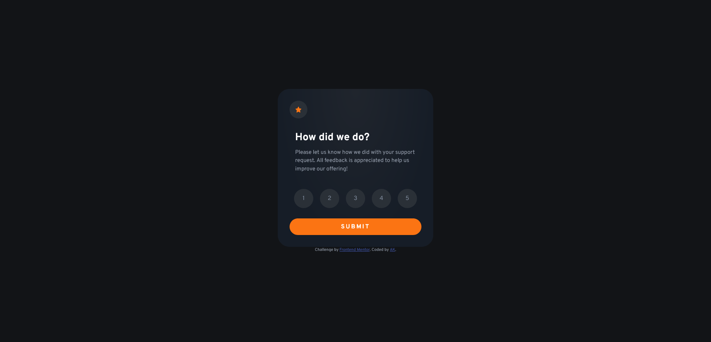
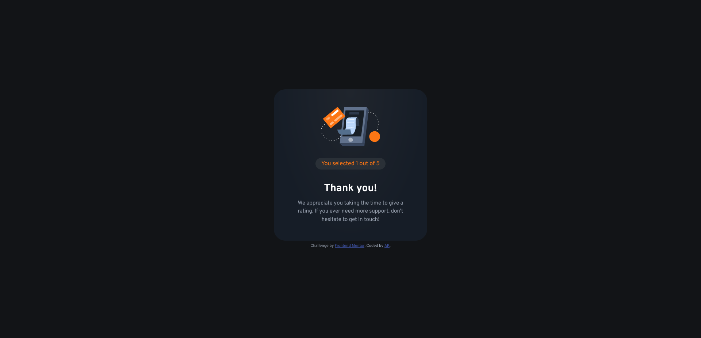

# Frontend Mentor - Interactive rating component solution

This is a solution to the [Interactive rating component challenge on Frontend Mentor](https://www.frontendmentor.io/challenges/interactive-rating-component-koxpeBUmI). Frontend Mentor challenges help you improve your coding skills by building realistic projects. 

## Table of contents

- [Overview](#overview)
  - [The challenge](#the-challenge)
  - [Screenshot](#screenshot)
  - [Links](#links)
- [My process](#my-process)
  - [Built with](#built-with)
  - [What I learned](#what-i-learned)
  - [Continued development](#continued-development)
  - [Useful resources](#useful-resources)
- [Author](#author)

## Overview

### The challenge

Users should be able to:

- View the optimal layout for the app depending on their device's screen size
- See hover states for all interactive elements on the page
- Select and submit a number rating
- See the "Thank you" card state after submitting a rating

### Screenshot

### Links

- Solution URL: [Add solution URL here](https://your-solution-url.com)
- Live Site URL: [Cloudfare Pages live site](https://fm-ak-interactive-rating-component.pages.dev/)

## My process

### Built with

- Semantic HTML5 markup
- CSS custom properties
- Flexbox
- Mobile-first workflow
- JavaScript 

### What I learned

This was my first Frontend Mentor challenge using JavaScript. However, I found the most difficult part of this challenge to be the sizing of all the component elements, as well as trying to match the colours as closely to the design as possible. 

In terms of JavaScript, the primary concept I learned during this challenge was the difference between an addEventListener method, and the onclick event. Onclick is an inline property that can listen for events. addEventListener can handle more than one event on the same element, while onclick cannot. 

### Continued development

In the future, I would like to further study on how to be write semantic HTML, and how to easily write CSS. There were several moments during this challenge where I found myself questioning whether I had chosen the correct method, such as whether or not the rating buttons should be a form or just an unordered list. 

### Useful resources

- ["addEventListener vs onclick: Which one should you use?"](https://tshlosberg.medium.com/addeventlistener-vs-onclick-which-one-should-you-use-47550d7e7487) - This article in Medium by Taci Shlosberg (Sept 13, 2020) was helpful on explaining the differences between addEventListener and onclick.

- [W3Schools](https://www.w3schools.com/howto/howto_js_toggle_hide_show.asp) - This tutorial was used to learn how to switch between the two separate states. 

## Author

- Frontend Mentor - [@angelkendall](https://www.frontendmentor.io/profile/angelkendall)

