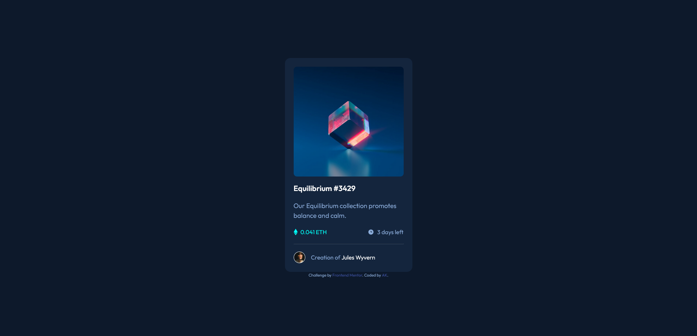

# Frontend Mentor - NFT preview card component solution

This is a solution to the [NFT preview card component challenge on Frontend Mentor](https://www.frontendmentor.io/challenges/nft-preview-card-component-SbdUL_w0U). Frontend Mentor challenges help you improve your coding skills by building realistic projects. 

## Table of contents

- [Overview](#overview)
  - [The challenge](#the-challenge)
  - [Screenshot](#screenshot)
  - [Links](#links)
- [My process](#my-process)
  - [Built with](#built-with)
  - [What I learned](#what-i-learned)
  - [Continued development](#continued-development)
  - [Useful resources](#useful-resources)
- [Author](#author)

## Overview

### The challenge

Users should be able to:

- View the optimal layout depending on their device's screen size
- See hover states for interactive elements

### Screenshot

### Links

- Solution URL: [Add solution URL here](https://your-solution-url.com)
- Live Site URL: [Cloudfare Pages live link](https://fm-ak-nft-preview-card-component.pages.dev/)

## My process

### Built with

- Semantic HTML5 markup
- CSS custom properties
- Flexbox

### What I learned

During this challenge, I learned about the 
 tag, how to create a coloured overlay for an image, and how to overlay an image over another. 

### Continued development

In the future, I wish to continue to learn how to best space out elements of the components on sites using methods such as padding, margin, or gaps. A fair amount of time during this challenge was spent trying to work out the gaps between each of the elements, and while I believe this issue could have been remedied by accessing the original Figma designs for the proper dimensions, I also believe there must be an easier way to do spacing, whether it is using a particular CSS attribute, or simply becoming better at judging with my own eyes. 

### Useful resources

- [W3Schools](https://www.w3schools.com/howto/howto_css_image_overlay_icon.asp) - This tutorial was exactly what was required to be able to get the primary image overlay to work, with the coloured background and icon placed on top. 

## Author

- Frontend Mentor - [@angelkendall](https://www.frontendmentor.io/profile/angelkendall)
