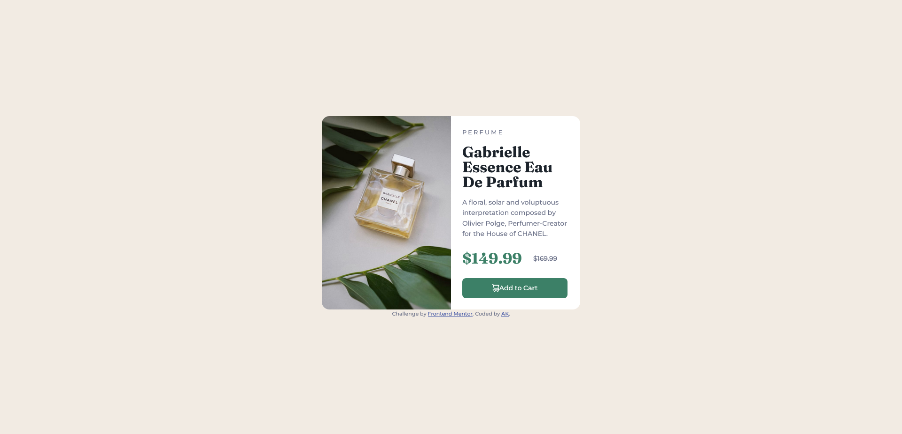

# Frontend Mentor - Product preview card component solution

This is a solution to the [Product preview card component challenge on Frontend Mentor](https://www.frontendmentor.io/challenges/product-preview-card-component-GO7UmttRfa). Frontend Mentor challenges help you improve your coding skills by building realistic projects. 

## Table of contents

- [Overview](#overview)
  - [The challenge](#the-challenge)
  - [Screenshot](#screenshot)
- [My process](#my-process)
  - [Built with](#built-with)
  - [What I learned](#what-i-learned)
  - [Useful resources](#useful-resources)
- [Author](#author)

## Overview

### The challenge

Users should be able to:

- View the optimal layout depending on their device's screen size
- See hover and focus states for interactive elements

### Screenshot

### Links

- Solution URL: [Add solution URL here](https://your-solution-url.com)
- Live Site URL: [Cloudfare Page Live Site](https://fm-ak-product-preview-card-component.pages.dev/)

## My process

### Built with

- Semantic HTML5 markup
- CSS custom properties
- Flexbox

### What I learned

This component challenge was my first time coming across both the <del> tag, and the aria-label attribute.  

### Useful resources

- [MDN web docs](https://developer.mozilla.org/en-US/docs/Web/HTML/Element/del) - This document thoroughly explained the <del> tag and the potential accessibility concerns behind using it. 

## Author
- Frontend Mentor - [@angelkendall](https://www.frontendmentor.io/profile/angelkendall)
